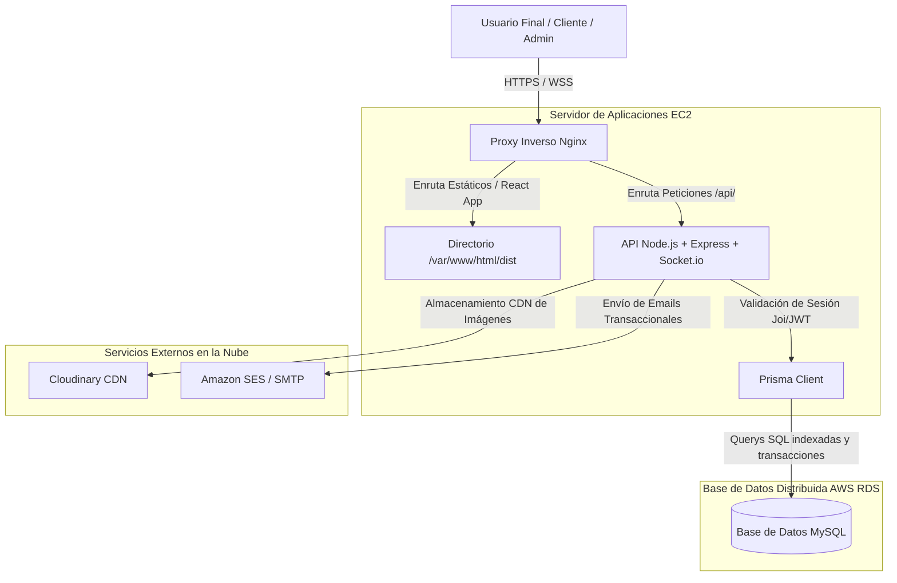
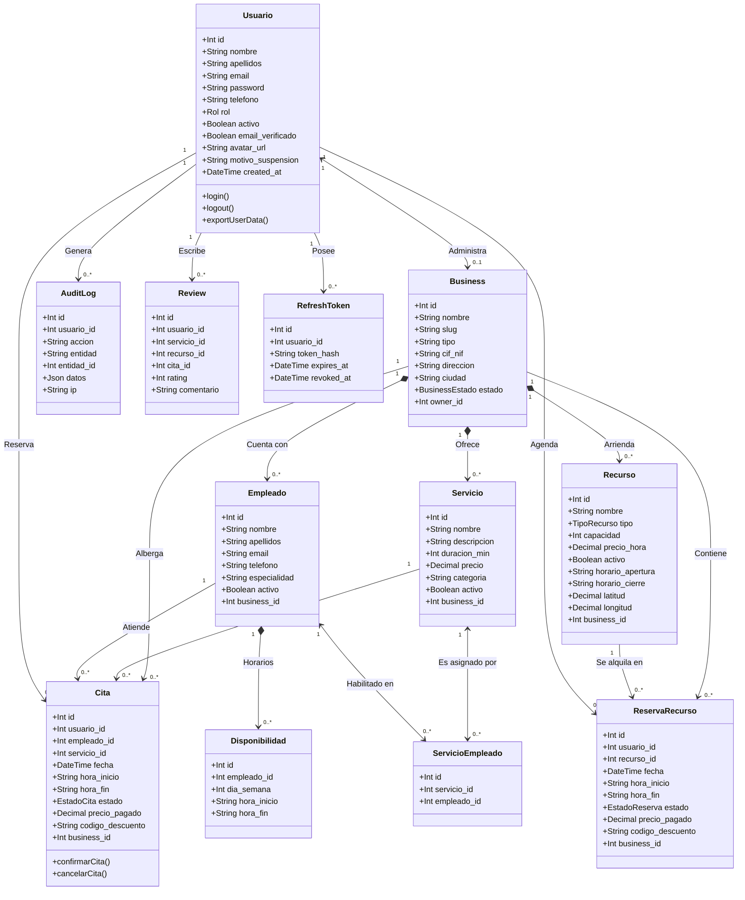
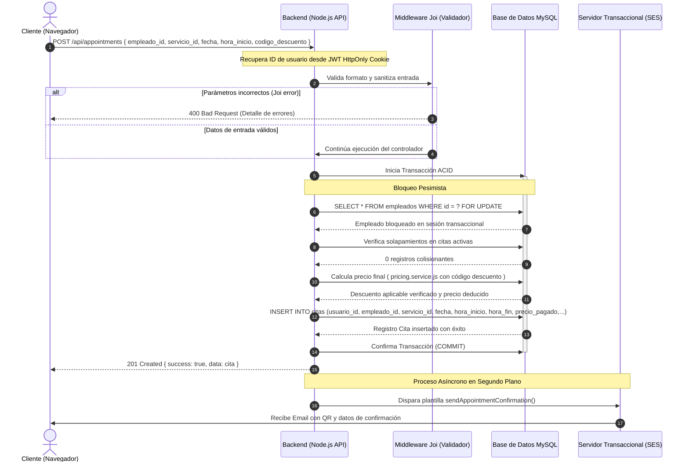
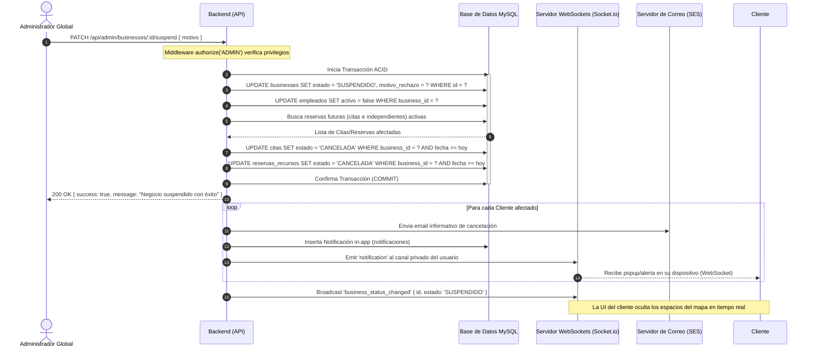
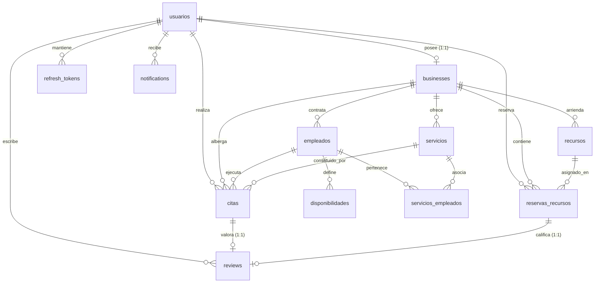

# FASE DE DISEÑO TÉCNICO Y ARQUITECTURAL (ENTREGA 2)
**TRABAJO FIN DE GRADO (TFG)**
**AÑO ACADÉMICO:** 2025/2026
**CICLO FORMATIVO:** 2º Desarrollo de Aplicaciones Multiplataforma (2º DAM)
**ALUMNO:** Andrei Iordache
**CENTRO EDUCATIVO:** IES Augustóbrigas
**FECHA DE ADAPTACIÓN:** 17 de Mayo de 2026

---

## 1. TÍTULO Y DESCRIPCIÓN GENERAL DEL PROYECTO

### Título
**CoworkPro — Plataforma SaaS Multi-Tenant de Gestión de Reservas y Espacios de Coworking**

### Descripción General
El proyecto ha evolucionado de un sistema de reservas tradicional local y monousuario a una **plataforma SaaS (Software as a Service) Multi-Tenant de nivel empresarial**. Esta arquitectura avanzada permite a cualquier negocio local (centros de estética, peluquerías, gimnasios, clínicas de salud y, de forma extendida, **centros de coworking o salas de trabajo compartido**) registrar su empresa en la plataforma bajo un subentorno aislado para ofrecer sus servicios o recursos.

El sistema se estructura bajo dos grandes líneas de negocio integradas:
1. **Modelo de Servicios Tradicionales (Citas con Personal):** Reservas de slots temporales con profesionales específicos (ej. corte de pelo con un peluquero en particular, sesiones de fisioterapia con un terapeuta asignado) gestionados mediante calendarios y slots de disponibilidad.
2. **Modelo de Recursos de Coworking (Espacios Físicos):** Reserva y gestión de recursos espaciales físicos (mesas de trabajo individuales, salas de reuniones privadas, oficinas dedicadas, despachos) facturados por hora o fracción temporal con control de capacidades e inventario técnico.

La aplicación es completamente responsiva y funciona como **PWA (Progressive Web App)**, lo que permite su instalación directa en dispositivos móviles (Android/iOS) y ordenadores personales. Incorpora una API REST robusta en Node.js, persistencia de datos relacional de alto rendimiento en MySQL, notificaciones push en tiempo real vía WebSockets (`Socket.io`), pasarela de facturación e importes calculados en servidor con soporte para códigos de descuento, exportación conforme a la RGPD y panel integrado de analíticas gerenciales para los propietarios.

---

## 2. IDENTIFICACIÓN DEL PROYECTO: PARTICIPANTES Y CENTROS

*   **Alumno / Participante:** Andrei Iordache
*   **Ciclo Formativo:** 2º Desarrollo de Aplicaciones Multiplataforma (2º DAM)
*   **Centro Educativo:** IES Augustóbrigas
*   **Proyecto Integrado de TFG**

---

## 3. OBJETIVOS

### Objetivo General
Diseñar, implementar y desplegar una plataforma SaaS multi-tenant y multiplataforma orientada a la gestión integrada de reservas de servicios y coworking en tiempo real, garantizando la consistencia transaccional y la seguridad de los datos.

### Objetivos Específicos
*   **Aislamiento y Multi-Tenancy:** Diseñar una base de datos relacional robusta que aísle lógicamente los datos de cada negocio local registrado.
*   **Seguridad de Grado Industrial:** Desarrollar un sistema de autenticación basado en JWT con doble esquema de token (Access Token corto y Refresh Token persistente en base de datos) almacenados en cookies seguras con directivas `httpOnly`, `secure` y `sameSite: strict`.
*   **Consistencia Transaccional Avanzada (Anti Race Conditions):** Resolver el problema clásico de la doble reserva simultánea mediante bloqueos pesimistas (`SELECT ... FOR UPDATE`) en base de datos durante el flujo transaccional.
*   **Modularidad Multiplataforma (PWA):** Construir una interfaz web responsiva de alta velocidad, optimizada con Code Splitting para carga dinámica y empaquetada como PWA para habilitar funcionamiento e instalación móvil.
*   **Sincronización en Tiempo Real:** Integrar canales de comunicación mediante WebSockets para empujar notificaciones al usuario instantáneamente e invalidar cachés de disponibilidad al alterarse los calendarios.
*   **Cumplimiento Normativo (RGPD):** Ofrecer un canal de exportación de datos transparente que permita a cualquier usuario descargar en formato estandarizado JSON todo su historial clínico, transaccional e in-app.

---

## 4. JUSTIFICACIÓN

El mercado actual de pequeñas y medianas empresas (PYMEs) requiere herramientas digitales que combinen simplicidad y capacidades de nivel corporativo. Las soluciones existentes suelen estar fragmentadas: o gestionan personal y servicios (citas en peluquerías) o gestionan inventario físico (coworkings). **CoworkPro** unifica ambos mundos en un modelo SaaS.

Desde el punto de vista académico de **Desarrollo de Aplicaciones Multiplataforma (DAM)**, este proyecto combina de forma integral:
1.  **Backend Distribuido:** Construido sobre Node.js + Express con validación estricta de esquemas de datos en tiempo de ejecución.
2.  **Persistencia Relacional y ORM:** Uso de **Prisma ORM** sobre **MySQL** en un esquema normalizado en 3FN que modela relaciones de N:M complejas, composiciones y herencia conceptual.
3.  **Despliegue e Infraestructura Cloud:** Arquitectura de producción planificada para Amazon Web Services (AWS) con Nginx actuando como proxy inverso, PM2 para resiliencia del backend y Amazon RDS para replicación de base de datos.

---

## 5. ASPECTOS PRINCIPALES DEL SISTEMA

| Componente | Tecnologías y Arquitectura Realizada |
| :--- | :--- |
| **Frontend** | Interfaz Web Reactiva (Single Page Application - SPA) con **React 19**, **Vite** y **Tailwind CSS v4** para diseño fluido. Integración de mapas dinámicos interactivos con **Leaflet** para geolocalización de negocios, sistema PWA para instalación híbrida móvil/escritorio, y **Socket.io-client** para notificaciones reactivas. |
| **Backend** | API RESTful en **Node.js** y **Express**. Arquitectura desacoplada en Controladores, Validadores (esquemas con **Joi**), Capa de Negocio (Servicios de disponibilidad, precios y scheduler de notificaciones) y Middleware de control de sesión y auditorías. |
| **Base de datos** | Persistencia transaccional ACID en **MySQL** (producción en AWS RDS) gestionada a través de **Prisma Client**. Estructura robusta con índices optimizados y soporte para operaciones complejas de concurrencia. |
| **Seguridad y Roles** | Autenticación robusta basada en cookies seguras. Esquema de roles diferenciado con middleware autorizador (`CLIENTE`, `BUSINESS_OWNER` y `ADMIN`). Verificación de email obligatoria por token SHA-256 e inicio automático de flujo para recuperación de contraseña. |
| **Tiempo Real y Extras** | WebSocket bidireccional en tiempo real para flujos de notificación interna. Sistema integrado de **Audit Trail** corporativo (`AuditLog`) para el cumplimiento e inspección de operaciones administrativas. Generación automatizada de correos transaccionales a través de **Nodemailer** y **Amazon SES**. |
| **Analíticas Integradas** | Dashboard dinámico corporativo para el `BUSINESS_OWNER` con visualización de ingresos mensuales, ratio de ocupación física, servicios más demandados y comportamiento de uso de clientes. |

---

## 6. MEDIOS QUE SE UTILIZARÁN



---

## 7. FASE DE DISEÑO TÉCNICO

### 7.1. Diagramas de Casos de Uso (UML)

El sistema soporta interacciones complejas basadas en privilegios de rol. Los tres actores principales interactúan con la plataforma de forma diferencial:

```mermaid
graph TD
    %% Definición de Actores
    subgraph Actores
        Cliente((Cliente Registrado))
        Owner((Propietario Negocio))
        Admin((Administrador Global))
    end

    %% Casos de Uso del Cliente
    subgraph Casos de Uso del Portal de Clientes
        UC_Exp[Explorar Servicios y Espacios]
        UC_ResS[Reservar Citas de Servicios]
        UC_ResR[Reservar Espacios de Coworking]
        UC_GDPR[Exportar Datos GDPR / Portabilidad]
        UC_Review[Escribir Reseña y Puntuación]
        UC_Notif[Recibir Notificaciones en Tiempo Real]
    end

    %% Casos de Uso del Propietario (Business Owner)
    subgraph Casos de Uso de Panel de Negocio
        UC_RegB[Registrar e Inscribir Negocio]
        UC_GestE[Gestionar Empleados]
        UC_GestS[Gestionar Catálogo de Servicios]
        UC_GestR[Gestionar Inventario de Recursos]
        UC_Disp[Configurar Calendarios y Disponibilidad]
        UC_Stats[Visualizar Estadísticas y Analítica]
    end

    %% Casos de Uso del Administrador Global
    subgraph Casos de Uso de Panel de Control Global
        UC_Appr[Aprobar o Rechazar Negocios Nuevos]
        UC_Susp[Suspender y Reactivar Negocios]
        UC_Audit[Auditar Logs del Sistema - AuditTrail]
        UC_Codes[Gestionar Códigos de Descuento]
    end

    %% Relaciones de Cliente
    Cliente --> UC_Exp
    Cliente --> UC_ResS
    Cliente --> UC_ResR
    Cliente --> UC_GDPR
    Cliente --> UC_Review
    Cliente --> UC_Notif

    %% Relaciones de Business Owner
    Owner --> UC_RegB
    Owner --> UC_GestE
    Owner --> UC_GestS
    Owner --> UC_GestR
    Owner --> UC_Disp
    Owner --> UC_Stats

    %% Relaciones de Administrador
    Admin --> UC_Appr
    Admin --> UC_Susp
    Admin --> UC_Audit
    Admin --> UC_Codes
```



---

### 7.2. Diagrama de Clases (UML)

El siguiente diagrama de clases representa la arquitectura de datos implementada bajo Prisma ORM. Modela las propiedades, tipos, y relaciones estructurales de la base de datos MySQL.



---

### 7.3. Diagramas de Secuencia (UML)

#### 7.3.1. Escenario 1: Flujo Seguro de Reserva con Bloqueo Pesimista (Concurrencia)
Muestra el proceso de reserva de una cita. El backend ejecuta un bloqueo pesimista en base de datos (`SELECT FOR UPDATE`) para evitar reservas solapadas en condiciones extremas de concurrencia.



---

#### 7.3.2. Escenario 2: Administración - Flujo en Cascada al Suspender un Negocio
Representa el proceso por el cual el administrador de la plataforma suspende un negocio. Muestra cómo el sistema invalida y cancela reservas futuras en cascada, notificando a los clientes de forma automática.



---

## 7.4. DISEÑO DE LA BASE DE DATOS (FASE DE DISEÑO LÓGICO)

### 7.4.1. Diagrama Entidad-Relación (E/R)

Este diagrama conceptual captura la cardinalidad y dependencias físicas del modelo normalizado de la base de datos relacional de **CoworkPro**.



---

### 7.4.2. Modelo Relacional (Normalizado a 3FN)

El diseño del esquema cumple estrictamente la **Tercera Forma Normal (3FN)**:
1.  **1FN:** Todos los atributos son atómicos, sin grupos repetitivos.
2.  **2FN:** Se encuentra en 1FN y todos los atributos que no forman parte de la clave primaria tienen una dependencia funcional completa de la clave primaria.
3.  **3FN:** Se encuentra en 2FN y ningún atributo no clave depende transitivamente de la clave primaria (los campos calculados como precios finales se derivan en lógica de servidor, no en almacenamiento de modelo).

#### Tabla: `usuarios`
*Almacena la información de autenticación y datos básicos de Clientes, Propietarios y Administradores.*
*   **Clave Primaria (PK):** `id` (INT, Autoincremental)
*   **Claves Foráneas (FK):** Ninguna
*   **Restricciones:** `email` (VARCHAR UNIQUE), `rol` (ENUM: 'CLIENTE', 'BUSINESS_OWNER', 'ADMIN')

#### Tabla: `businesses`
*Contiene la información de los negocios integrados bajo el modelo de suscripción SaaS.*
*   **Clave Primaria (PK):** `id` (INT, Autoincremental)
*   **Claves Foráneas (FK):** `owner_id` (INT) -> `usuarios(id)` ON DELETE CASCADE
*   **Restricciones:** `slug` (VARCHAR UNIQUE), `cif_nif` (VARCHAR UNIQUE), `estado` (ENUM: 'PENDIENTE', 'ACTIVO', 'SUSPENDIDO', 'RECHAZADO')

#### Tabla: `empleados`
*Almacena los profesionales contratados por los negocios locales para proveer servicios.*
*   **Clave Primaria (PK):** `id` (INT, Autoincremental)
*   **Claves Foráneas (FK):** `business_id` (INT, Nullable) -> `businesses(id)` ON DELETE SET NULL
*   **Restricciones:** `email` (VARCHAR UNIQUE)

#### Tabla: `servicios`
*Catálogo de servicios parametrizados que ofrece cada negocio local.*
*   **Clave Primaria (PK):** `id` (INT, Autoincremental)
*   **Claves Foráneas (FK):** `business_id` (INT, Nullable) -> `businesses(id)` ON DELETE SET NULL
*   **Restricciones:** `duracion_min` (INT CHECK > 0), `precio` (DECIMAL(10,2))

#### Tabla: `servicios_empleados`
*Tabla de unión N:M para relacionar qué empleados están cualificados para dar qué servicios.*
*   **Clave Primaria (PK):** `id` (INT, Autoincremental)
*   **Claves Foráneas (FK):**
    *   `servicio_id` (INT) -> `servicios(id)` ON DELETE CASCADE
    *   `empleado_id` (INT) -> `empleados(id)` ON DELETE CASCADE
*   **Restricciones:** Índice único compuesto por `(servicio_id, empleado_id)`

#### Tabla: `disponibilidades`
*Configuración de horas de entrada y salida semanales recurrentes del personal.*
*   **Clave Primaria (PK):** `id` (INT, Autoincremental)
*   **Claves Foráneas (FK):** `empleado_id` (INT) -> `empleados(id)` ON DELETE CASCADE
*   **Restricciones:** `dia_semana` (INT, 0=Lunes a 6=Domingo), `hora_inicio`, `hora_fin` (VARCHAR 5, "HH:MM")

#### Tabla: `citas`
*Registros transaccionales de reservas de servicios tradicionales.*
*   **Clave Primaria (PK):** `id` (INT, Autoincremental)
*   **Claves Foráneas (FK):**
    *   `usuario_id` (INT) -> `usuarios(id)` ON DELETE CASCADE
    *   `empleado_id` (INT) -> `empleados(id)` ON DELETE CASCADE
    *   `servicio_id` (INT) -> `servicios(id)` ON DELETE CASCADE
    *   `business_id` (INT, Nullable) -> `businesses(id)` ON DELETE SET NULL
*   **Restricciones:** `estado` (ENUM: 'PENDIENTE', 'CONFIRMADA', 'CANCELADA', 'COMPLETADA')

#### Tabla: `recursos`
*Inventario de puestos, mesas, salas o despachos propios de los coworkings.*
*   **Clave Primaria (PK):** `id` (INT, Autoincremental)
*   **Claves Foráneas (FK):** `business_id` (INT, Nullable) -> `businesses(id)` ON DELETE SET NULL
*   **Restricciones:** `tipo` (ENUM: 'MESA', 'SALA', 'PUESTO', 'DESPACHO')

#### Tabla: `reservas_recursos`
*Registros transaccionales de arriendo por horas de espacios de coworking.*
*   **Clave Primaria (PK):** `id` (INT, Autoincremental)
*   **Claves Foráneas (FK):**
    *   `usuario_id` (INT) -> `usuarios(id)` ON DELETE CASCADE
    *   `recurso_id` (INT) -> `recursos(id)` ON DELETE CASCADE
    *   `business_id` (INT, Nullable) -> `businesses(id)` ON DELETE SET NULL
*   **Restricciones:** `estado` (ENUM: 'PENDIENTE', 'CONFIRMADA', 'CANCELADA', 'COMPLETADA')

#### Tabla: `reviews`
*Sistema integrado de puntuación y feedback.*
*   **Clave Primaria (PK):** `id` (INT, Autoincremental)
*   **Claves Foráneas (FK):**
    *   `usuario_id` (INT) -> `usuarios(id)` ON DELETE CASCADE
    *   `servicio_id` (INT, Nullable) -> `servicios(id)` ON DELETE CASCADE
    *   `recurso_id` (INT, Nullable) -> `recursos(id)` ON DELETE CASCADE
    *   `cita_id` (INT, Nullable) -> `citas(id)` ON DELETE SET NULL
    *   `reserva_recurso_id` (INT, Nullable) -> `reservas_recursos(id)` ON DELETE SET NULL
*   **Restricciones:** `rating` (INT entre 1 y 5), Índices únicos en `cita_id` y `reserva_recurso_id` para garantizar "una review por reserva".

#### Tabla: `audit_logs`
*Historial de auditoría para monitorización de seguridad interna.*
*   **Clave Primaria (PK):** `id` (INT, Autoincremental)
*   **Claves Foráneas (FK):** Ninguna (se mantiene desacoplado para no corromper el log si se borra un usuario)
*   **Restricciones:** `datos` (Campo JSON nativo de MySQL)

#### Tabla: `refresh_tokens`
*Historial de hashes de tokens de refresco activos e invalidados para rotación.*
*   **Clave Primaria (PK):** `id` (INT, Autoincremental)
*   **Claves Foráneas (FK):** `usuario_id` (INT) -> `usuarios(id)` ON DELETE CASCADE
*   **Restricciones:** `token_hash` (VARCHAR UNIQUE)

---

## 7.5. SCRIPT DE IMPLEMENTACIÓN (SQL)

El siguiente script en dialecto **MySQL 8.0** implementa la base de datos física descrita en la fase lógica. Incluye la creación de esquemas, relaciones mediante claves foráneas, restricciones de control e índices óptimos para soportar el flujo transaccional y el aislamiento multi-tenant.

```sql
-- =========================================================================
-- SCRIPT DE CREACIÓN DE BASE DE DATOS FÍSICA - COWORKPRO (MYSQL 8.0)
-- TRABAJO FIN DE GRADO - DESARROLLO DE APLICACIONES MULTIPLATAFORMA
-- =========================================================================

CREATE DATABASE IF NOT EXISTS coworkpro CHARACTER SET utf8mb4 COLLATE utf8mb4_unicode_ci;
USE coworkpro;

-- Desactivar temporalmente restricciones de FK para la inicialización limpia
SET FOREIGN_KEY_CHECKS = 0;

-- =========================================================================
-- 1. TABLA: usuarios
-- =========================================================================
CREATE TABLE usuarios (
    id INT AUTO_INCREMENT,
    nombre VARCHAR(100) NOT NULL,
    apellidos VARCHAR(150) NOT NULL,
    email VARCHAR(255) NOT NULL,
    password VARCHAR(255) NOT NULL,
    telefono VARCHAR(20) NULL,
    rol ENUM('CLIENTE', 'ADMIN', 'BUSINESS_OWNER') NOT NULL DEFAULT 'CLIENTE',
    avatar_url VARCHAR(500) NULL,
    activo BOOLEAN NOT NULL DEFAULT TRUE,
    motivo_suspension VARCHAR(500) NULL,
    email_verificado BOOLEAN NOT NULL DEFAULT FALSE,
    created_at DATETIME NOT NULL DEFAULT CURRENT_TIMESTAMP,
    updated_at DATETIME NOT NULL DEFAULT CURRENT_TIMESTAMP ON UPDATE CURRENT_TIMESTAMP,
    
    PRIMARY KEY (id),
    CONSTRAINT uq_usuarios_email UNIQUE (email)
) ENGINE=InnoDB;

-- =========================================================================
-- 2. TABLA: businesses (Entidades Multi-tenant)
-- =========================================================================
CREATE TABLE businesses (
    id INT AUTO_INCREMENT,
    nombre VARCHAR(150) NOT NULL,
    slug VARCHAR(180) NOT NULL,
    tipo VARCHAR(40) NOT NULL, -- 'COWORKING', 'PELUQUERIA', 'SPA', etc.
    cif_nif VARCHAR(20) NOT NULL,
    descripcion TEXT NULL,
    direccion VARCHAR(255) NOT NULL,
    ciudad VARCHAR(100) NOT NULL,
    codigo_postal VARCHAR(10) NOT NULL,
    lat DOUBLE NULL,
    lng DOUBLE NULL,
    telefono VARCHAR(20) NOT NULL,
    web VARCHAR(255) NULL,
    logo_url VARCHAR(500) NULL,
    fotos_urls JSON NULL,      -- Array de URLs
    horario JSON NULL,         -- JSON de configuracion semanal
    festivos JSON NULL,        -- Array de fechas
    estado ENUM('PENDIENTE', 'ACTIVO', 'SUSPENDIDO', 'RECHAZADO') NOT NULL DEFAULT 'PENDIENTE',
    motivo_rechazo VARCHAR(500) NULL,
    owner_id INT NOT NULL,
    created_at DATETIME NOT NULL DEFAULT CURRENT_TIMESTAMP,
    updated_at DATETIME NOT NULL DEFAULT CURRENT_TIMESTAMP ON UPDATE CURRENT_TIMESTAMP,

    PRIMARY KEY (id),
    CONSTRAINT uq_businesses_slug UNIQUE (slug),
    CONSTRAINT uq_businesses_cif_nif UNIQUE (cif_nif),
    CONSTRAINT uq_businesses_owner_id UNIQUE (owner_id),
    CONSTRAINT fk_businesses_owner FOREIGN KEY (owner_id) REFERENCES usuarios (id) ON DELETE CASCADE
) ENGINE=InnoDB;

-- =========================================================================
-- 3. TABLA: empleados
-- =========================================================================
CREATE TABLE empleados (
    id INT AUTO_INCREMENT,
    nombre VARCHAR(100) NOT NULL,
    apellidos VARCHAR(150) NOT NULL,
    email VARCHAR(255) NOT NULL,
    telefono VARCHAR(20) NULL,
    especialidad VARCHAR(200) NULL,
    avatar_url VARCHAR(500) NULL,
    activo BOOLEAN NOT NULL DEFAULT TRUE,
    business_id INT NULL,
    created_at DATETIME NOT NULL DEFAULT CURRENT_TIMESTAMP,

    PRIMARY KEY (id),
    CONSTRAINT uq_empleados_email UNIQUE (email),
    CONSTRAINT fk_empleados_business FOREIGN KEY (business_id) REFERENCES businesses (id) ON DELETE SET NULL
) ENGINE=InnoDB;

-- =========================================================================
-- 4. TABLA: servicios
-- =========================================================================
CREATE TABLE servicios (
    id INT AUTO_INCREMENT,
    nombre VARCHAR(150) NOT NULL,
    descripcion TEXT NULL,
    duracion_min INT NOT NULL,
    precio DECIMAL(10, 2) NOT NULL,
    categoria VARCHAR(100) NULL,
    imagen_url VARCHAR(500) NULL,
    activo BOOLEAN NOT NULL DEFAULT TRUE,
    business_id INT NULL,
    created_at DATETIME NOT NULL DEFAULT CURRENT_TIMESTAMP,

    PRIMARY KEY (id),
    CONSTRAINT chk_servicios_duracion CHECK (duracion_min > 0),
    CONSTRAINT fk_servicios_business FOREIGN KEY (business_id) REFERENCES businesses (id) ON DELETE SET NULL
) ENGINE=InnoDB;

-- =========================================================================
-- 5. TABLA: servicios_empleados (Tabla de Unión N:M)
-- =========================================================================
CREATE TABLE servicios_empleados (
    id INT AUTO_INCREMENT,
    servicio_id INT NOT NULL,
    empleado_id INT NOT NULL,

    PRIMARY KEY (id),
    CONSTRAINT uq_servicio_empleado UNIQUE (servicio_id, empleado_id),
    CONSTRAINT fk_se_servicio FOREIGN KEY (servicio_id) REFERENCES servicios (id) ON DELETE CASCADE,
    CONSTRAINT fk_se_empleado FOREIGN KEY (empleado_id) REFERENCES empleados (id) ON DELETE CASCADE
) ENGINE=InnoDB;

-- =========================================================================
-- 6. TABLA: disponibilidades (Horarios de Empleados)
-- =========================================================================
CREATE TABLE disponibilidades (
    id INT AUTO_INCREMENT,
    empleado_id INT NOT NULL,
    dia_semana INT NOT NULL, -- 0=Lunes, 6=Domingo
    hora_inicio VARCHAR(5) NOT NULL, -- "HH:MM"
    hora_fin VARCHAR(5) NOT NULL,    -- "HH:MM"

    PRIMARY KEY (id),
    CONSTRAINT chk_dia_semana CHECK (dia_semana BETWEEN 0 AND 6),
    CONSTRAINT fk_disponibilidades_empleado FOREIGN KEY (empleado_id) REFERENCES empleados (id) ON DELETE CASCADE
) ENGINE=InnoDB;

-- =========================================================================
-- 7. TABLA: citas (Transacciones de Servicios)
-- =========================================================================
CREATE TABLE citas (
    id INT AUTO_INCREMENT,
    usuario_id INT NOT NULL,
    empleado_id INT NOT NULL,
    servicio_id INT NOT NULL,
    fecha DATE NOT NULL,
    hora_inicio VARCHAR(5) NOT NULL,
    hora_fin VARCHAR(5) NOT NULL,
    estado ENUM('PENDIENTE', 'CONFIRMADA', 'CANCELADA', 'COMPLETADA') NOT NULL DEFAULT 'PENDIENTE',
    notas TEXT NULL,
    precio_pagado DECIMAL(10, 2) NULL,
    codigo_descuento VARCHAR(50) NULL,
    review_request_sent_at DATETIME NULL,
    business_id INT NULL,
    created_at DATETIME NOT NULL DEFAULT CURRENT_TIMESTAMP,
    updated_at DATETIME NOT NULL DEFAULT CURRENT_TIMESTAMP ON UPDATE CURRENT_TIMESTAMP,

    PRIMARY KEY (id),
    CONSTRAINT fk_citas_usuario FOREIGN KEY (usuario_id) REFERENCES usuarios (id) ON DELETE CASCADE,
    CONSTRAINT fk_citas_empleado FOREIGN KEY (empleado_id) REFERENCES empleados (id) ON DELETE CASCADE,
    CONSTRAINT fk_citas_servicio FOREIGN KEY (servicio_id) REFERENCES servicios (id) ON DELETE CASCADE,
    CONSTRAINT fk_citas_business FOREIGN KEY (business_id) REFERENCES businesses (id) ON DELETE SET NULL
) ENGINE=InnoDB;

-- =========================================================================
-- 8. TABLA: recursos (Físicos de Coworking)
-- =========================================================================
CREATE TABLE recursos (
    id INT AUTO_INCREMENT,
    nombre VARCHAR(150) NOT NULL,
    tipo ENUM('MESA', 'SALA', 'PUESTO', 'DESPACHO') NOT NULL,
    descripcion TEXT NULL,
    capacidad INT NOT NULL DEFAULT 1,
    ubicacion VARCHAR(200) NULL,
    precio_hora DECIMAL(10, 2) NOT NULL,
    imagen_url VARCHAR(500) NULL,
    equipamiento TEXT NULL,
    activo BOOLEAN NOT NULL DEFAULT TRUE,
    horario_apertura VARCHAR(5) NOT NULL DEFAULT '08:00',
    horario_cierre VARCHAR(5) NOT NULL DEFAULT '20:00',
    latitud DECIMAL(10, 7) NULL,
    longitud DECIMAL(10, 7) NULL,
    business_id INT NULL,
    created_at DATETIME NOT NULL DEFAULT CURRENT_TIMESTAMP,

    PRIMARY KEY (id),
    CONSTRAINT fk_recursos_business FOREIGN KEY (business_id) REFERENCES businesses (id) ON DELETE SET NULL
) ENGINE=InnoDB;

-- =========================================================================
-- 9. TABLA: reservas_recursos (Transacciones de Coworking)
-- =========================================================================
CREATE TABLE reservas_recursos (
    id INT AUTO_INCREMENT,
    usuario_id INT NOT NULL,
    recurso_id INT NOT NULL,
    fecha DATE NOT NULL,
    hora_inicio VARCHAR(5) NOT NULL,
    hora_fin VARCHAR(5) NOT NULL,
    estado ENUM('PENDIENTE', 'CONFIRMADA', 'CANCELADA', 'COMPLETADA') NOT NULL DEFAULT 'PENDIENTE',
    notas TEXT NULL,
    precio_pagado DECIMAL(10, 2) NULL,
    codigo_descuento VARCHAR(50) NULL,
    review_request_sent_at DATETIME NULL,
    business_id INT NULL,
    created_at DATETIME NOT NULL DEFAULT CURRENT_TIMESTAMP,
    updated_at DATETIME NOT NULL DEFAULT CURRENT_TIMESTAMP ON UPDATE CURRENT_TIMESTAMP,

    PRIMARY KEY (id),
    CONSTRAINT fk_reservas_usuario FOREIGN KEY (usuario_id) REFERENCES usuarios (id) ON DELETE CASCADE,
    CONSTRAINT fk_reservas_recurso FOREIGN KEY (recurso_id) REFERENCES recursos (id) ON DELETE CASCADE,
    CONSTRAINT fk_reservas_business FOREIGN KEY (business_id) REFERENCES businesses (id) ON DELETE SET NULL
) ENGINE=InnoDB;

-- =========================================================================
-- 10. TABLA: reviews (Feedback / Calificaciones)
-- =========================================================================
CREATE TABLE reviews (
    id INT AUTO_INCREMENT,
    usuario_id INT NOT NULL,
    servicio_id INT NULL,
    recurso_id INT NULL,
    cita_id INT NULL,
    reserva_recurso_id INT NULL,
    rating INT NOT NULL,
    comentario TEXT NULL,
    created_at DATETIME NOT NULL DEFAULT CURRENT_TIMESTAMP,

    PRIMARY KEY (id),
    CONSTRAINT chk_reviews_rating CHECK (rating BETWEEN 1 AND 5),
    CONSTRAINT uq_reviews_cita UNIQUE (cita_id),
    CONSTRAINT uq_reviews_reserva UNIQUE (reserva_recurso_id),
    CONSTRAINT fk_reviews_usuario FOREIGN KEY (usuario_id) REFERENCES usuarios (id) ON DELETE CASCADE,
    CONSTRAINT fk_reviews_servicio FOREIGN KEY (servicio_id) REFERENCES servicios (id) ON DELETE CASCADE,
    CONSTRAINT fk_reviews_recurso FOREIGN KEY (recurso_id) REFERENCES recursos (id) ON DELETE CASCADE,
    CONSTRAINT fk_reviews_cita FOREIGN KEY (cita_id) REFERENCES citas (id) ON DELETE SET NULL,
    CONSTRAINT fk_reviews_reserva FOREIGN KEY (reserva_recurso_id) REFERENCES reservas_recursos (id) ON DELETE SET NULL
) ENGINE=InnoDB;

-- =========================================================================
-- 11. TABLA: audit_logs (Seguridad y Trazabilidad)
-- =========================================================================
CREATE TABLE audit_logs (
    id INT AUTO_INCREMENT,
    usuario_id INT NULL,
    accion VARCHAR(100) NOT NULL,
    entidad VARCHAR(50) NOT NULL,
    entidad_id INT NULL,
    datos JSON NULL,
    ip VARCHAR(45) NULL,
    created_at DATETIME NOT NULL DEFAULT CURRENT_TIMESTAMP,

    PRIMARY KEY (id)
) ENGINE=InnoDB;

-- =========================================================================
-- 12. TABLA: refresh_tokens (Gestión de Sesiones Concurrentes)
-- =========================================================================
CREATE TABLE refresh_tokens (
    id INT AUTO_INCREMENT,
    usuario_id INT NOT NULL,
    token_hash VARCHAR(255) NOT NULL,
    expires_at DATETIME NOT NULL,
    revoked_at DATETIME NULL,
    created_at DATETIME NOT NULL DEFAULT CURRENT_TIMESTAMP,

    PRIMARY KEY (id),
    CONSTRAINT uq_rt_hash UNIQUE (token_hash),
    CONSTRAINT fk_rt_usuario FOREIGN KEY (usuario_id) REFERENCES usuarios (id) ON DELETE CASCADE
) ENGINE=InnoDB;

-- =========================================================================
-- 13. TABLAS DE SOPORTE DE CUENTA (Email y Contraseñas)
-- =========================================================================
CREATE TABLE password_reset_tokens (
    id INT AUTO_INCREMENT,
    usuario_id INT NOT NULL,
    token VARCHAR(255) NOT NULL,
    expira_at DATETIME NOT NULL,
    created_at DATETIME NOT NULL DEFAULT CURRENT_TIMESTAMP,

    PRIMARY KEY (id),
    CONSTRAINT uq_prt_usuario UNIQUE (usuario_id),
    CONSTRAINT uq_prt_token UNIQUE (token),
    CONSTRAINT fk_prt_usuario FOREIGN KEY (usuario_id) REFERENCES usuarios (id) ON DELETE CASCADE
) ENGINE=InnoDB;

CREATE TABLE email_verification_tokens (
    id INT AUTO_INCREMENT,
    usuario_id INT NOT NULL,
    token VARCHAR(255) NOT NULL,
    expira_at DATETIME NOT NULL,
    created_at DATETIME NOT NULL DEFAULT CURRENT_TIMESTAMP,

    PRIMARY KEY (id),
    CONSTRAINT uq_evt_usuario UNIQUE (usuario_id),
    CONSTRAINT uq_evt_token UNIQUE (token),
    CONSTRAINT fk_evt_usuario FOREIGN KEY (usuario_id) REFERENCES usuarios (id) ON DELETE CASCADE
) ENGINE=InnoDB;

-- =========================================================================
-- 14. TABLAS ADICIONALES (Notificaciones y Descuentos)
-- =========================================================================
CREATE TABLE notifications (
    id INT AUTO_INCREMENT,
    usuario_id INT NOT NULL,
    type VARCHAR(20) NOT NULL, -- 'info', 'success', 'warning', 'error'
    title VARCHAR(200) NOT NULL,
    body TEXT NULL,
    `read` BOOLEAN NOT NULL DEFAULT FALSE,
    created_at DATETIME NOT NULL DEFAULT CURRENT_TIMESTAMP,

    PRIMARY KEY (id),
    CONSTRAINT fk_notifications_usuario FOREIGN KEY (usuario_id) REFERENCES usuarios (id) ON DELETE CASCADE
) ENGINE=InnoDB;

CREATE TABLE codigos_descuento (
    id INT AUTO_INCREMENT,
    codigo VARCHAR(50) NOT NULL,
    porcentaje INT NOT NULL,
    descripcion VARCHAR(255) NULL,
    max_usos INT NULL,
    usos_actuales INT NOT NULL DEFAULT 0,
    fecha_expiry DATETIME NULL,
    activo BOOLEAN NOT NULL DEFAULT TRUE,
    created_at DATETIME NOT NULL DEFAULT CURRENT_TIMESTAMP,

    PRIMARY KEY (id),
    CONSTRAINT uq_codigos_codigo UNIQUE (codigo),
    CONSTRAINT chk_codigos_porcentaje CHECK (porcentaje BETWEEN 1 AND 100)
) ENGINE=InnoDB;

-- =========================================================================
-- 15. CREACIÓN DE ÍNDICES DE RENDIMIENTO (CRÍTICOS PARA MULTI-TENANCY)
-- =========================================================================

-- Índices en tabla citas para velocidad de consulta mensual por negocio e histórico
CREATE INDEX idx_citas_business_fecha ON citas (business_id, fecha);
CREATE INDEX idx_citas_usuario ON citas (usuario_id);
CREATE INDEX idx_citas_empleado_fecha ON citas (empleado_id, fecha);

-- Índices en reservas de recursos para optimizar solapamientos concurrentes
CREATE INDEX idx_reservas_recurso_fecha ON reservas_recursos (recurso_id, fecha);
CREATE INDEX idx_reservas_usuario ON reservas_recursos (usuario_id);
CREATE INDEX idx_reservas_business ON reservas_recursos (business_id);

-- Índices de auditoría y notificaciones
CREATE INDEX idx_audit_logs_entidad ON audit_logs (entidad, entidad_id);
CREATE INDEX idx_notifications_usuario_read ON notifications (usuario_id, `read`);

-- Reactivar validaciones de FK
SET FOREIGN_KEY_CHECKS = 1;

-- =========================================================================
-- FIN DEL SCRIPT DE PERSISTENCIA
-- =========================================================================
```

---

## 8. CONCLUSIÓN DE LA FASE DE DISEÑO

La arquitectura técnica presentada para **CoworkPro** eleva el proyecto de una simple aplicación local a un sistema SaaS robusto, moderno y preparado para su despliegue comercial en producción (sobre la infraestructura AWS documentada). 

El estricto cumplimiento del estándar **3FN** en base de datos, la mitigación a bajo nivel de las condiciones de carrera mediante transacciones serializadas y bloqueos pesimistas, el doble factor de token JWT con rotación persistente y el enfoque híbrido multiplataforma (React + PWA) representan de forma sobresaliente el conjunto de competencias avanzadas exigidas en el ciclo formativo de **Desarrollo de Aplicaciones Multiplataforma (DAM)**.
