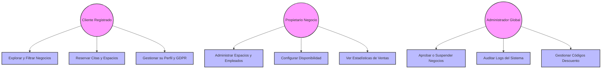

# CAPÍTULO 2: ANÁLISIS DE REQUISITOS

## 2.1. Objetivos Detallados (Requisitos Funcionales)

Para garantizar la modularidad y el aislamiento lógico de un sistema SaaS multi-tenant, **CoworkPro** define sus objetivos funcionales dividiéndolos según el rol del actor que interactúa con la plataforma. El sistema cuenta con tres actores principales: el **Cliente Registrado**, el **Propietario de Negocio (Business Owner)** y el **Administrador Global (System Admin)**.

### 2.1.1. Objetivos del Portal del Cliente
El objetivo primordial del portal de clientes es proporcionar una experiencia de reserva autogestionada, fluida y reactiva:
*   **Búsqueda y Geolocalización:** Permitir al cliente buscar negocios de servicios o coworking sobre un mapa interactivo dinámico, filtrando por categoría, ciudad o disponibilidad horaria.
*   **Gestión de Citas (Servicios):** Facilitar la reserva de citas con profesionales específicos (ej. citas de peluquería o fisioterapia) seleccionando el empleado, el servicio y el slot temporal libre en base a la agenda real del empleado.
*   **Reserva de Recursos Físicos (Espacios):** Permitir el arriendo temporal por horas de recursos físicos de coworking (mesas de trabajo, salas de reuniones, despachos) calculando el importe dinámicamente y evitando solapamientos horarios.
*   **Pasarela e Historial de Reservas:** Visualizar sus reservas pasadas y futuras, obtener recibos de pago con códigos de descuento aplicados y permitir la cancelación de reservas bajo políticas de tiempo límite.
*   **Políticas RGPD (Cumplimiento Legal):** Ofrecer una herramienta para descargar en un archivo estructurado JSON todos sus datos personales e historial transaccional en un solo clic, garantizando el derecho de portabilidad.

### 2.1.2. Objetivos del Panel del Propietario de Negocio (Business Owner)
Este panel proporciona al administrador del negocio las herramientas gerenciales para gestionar sus operaciones en tiempo real:
*   **Registro e Inscripción Multi-tenant:** Permitir el alta del negocio (slug único de URL, CIF, dirección geográfica, geolocalización, fotos, descripción y configuración horaria base) para someterlo a validación de la plataforma.
*   **Gestión de Catálogo de Servicios y Recursos:** CRUD completo de servicios ofrecidos (duración, precio, categoría) y de recursos físicos disponibles para arriendo.
*   **Gestión del Personal y Disponibilidad:** CRUD de empleados asignados al negocio y configuración fina de sus calendarios semanales e indisponibilidades (días festivos, vacaciones).
*   **Dashboard Gerencial (Analíticas):** Visualizar gráficas de ingresos mensuales acumulados, ratio de ocupación de sus espacios físicos, servicios más solicitados e historial detallado de clientes.

### 2.1.3. Objetivos del Panel del Administrador Global
Es el módulo de gobernanza y control de la plataforma SaaS:
*   **Moderación de Alta de Negocios:** Validar los registros de nuevos negocios (revisando CIF y datos), aprobando su activación comercial o rechazándolos especificando un motivo.
*   **Control Perimetral y Suspensión:** Suspender negocios que violen las condiciones de uso, lo cual activa de forma automática una transacción de cancelación y reembolso en cascada de todas sus citas futuras pendientes de manera asíncrona.
*   **Auditoría de Seguridad (Audit Trail):** Registrar de forma inmutable todas las acciones críticas del sistema (quién, cuándo, qué acción, sobre qué entidad y desde qué IP) para inspección técnica.
*   **Gestión de Cupones:** Crear, modificar e invalidar códigos de descuento globales utilizables por los clientes durante el checkout.

---

## 2.2. Tecnologías Utilizadas

La arquitectura técnica de **CoworkPro** ha sido seleccionada cuidadosamente para cumplir con estándares de escalabilidad, seguridad transaccional, fluidez en la interfaz (UX) y despliegue robusto en la nube.

| Capa / Componente | Tecnología | Versión | Propósito Técnico en el Proyecto |
| :--- | :--- | :--- | :--- |
| **Frontend SPA** | React | 19.x | Biblioteca principal para construir la interfaz SPA de alta reactividad mediante componentes reutilizables y manejo eficiente del DOM virtual. |
| **Herramienta Build** | Vite | 8.x | Empaquetador ultra-rápido para el desarrollo frontend y compilación de producción optimizada mediante *Code Splitting* y minificación. |
| **Estilos CSS** | Tailwind CSS | v4 | Framework de utilidades CSS para un diseño fluido, responsivo y adaptado a móviles bajo directrices de diseño corporativo moderno. |
| **Mapas Dinámicos** | Leaflet | 1.9 | Integración de mapas geográficos interactivos para la localización de los centros en tiempo real. |
| **API REST Backend** | Node.js / Express | 22.x / 4.x | Entorno de ejecución de servidor en JavaScript rápido y escalable. Express gestiona el enrutamiento HTTP y los middlewares de sesión. |
| **Capa de Datos (ORM)** | Prisma ORM | 6.x | ORM de última generación para modelado estricto de esquemas, migraciones automatizadas e integración fluida con MySQL. |
| **Motor BD Relacional** | MySQL Community | 8.0 | Motor de base de datos relacional robusto con soporte nativo de transacciones ACID y bloqueos optimizados para concurrencia. |
| **Mensajería WebSockets** | Socket.io | 4.8 | Comunicación bidireccional asíncrona para empujar notificaciones a los clientes e invalidar cachés de reserva en tiempo real. |
| **Servidor Físico (Cloud)** | AWS EC2 (t3.medium) | Ubuntu | Servidor virtual en la nube dotado de 2 vCPUs y 4 GB de RAM encargado de compilar el frontend y ejecutar el backend. |
| **BD Gestionada (Cloud)** | AWS RDS (db.t4g.micro) | MySQL | Servidor de base de datos MySQL aislado en subredes privadas, optimizado bajo chips Graviton2 (ARM) de alta eficiencia. |
| **Proxy Inverso Nginx** | Nginx | 1.24 | Servidor HTTP encargado de servir el frontend React y actuar como proxy inverso redirigiendo peticiones de API y WebSockets. |
| **Gestión de Procesos** | PM2 | 5.4 | Gestor de procesos de producción de Node.js que mantiene el backend corriendo y autoinicia el servicio ante reinicios del sistema. |
| **Seguridad / Cifrado** | jsonwebtoken / bcryptjs | - | `jsonwebtoken` gestiona la autenticación mediante tokens JWT firmados de forma segura; `bcryptjs` cifra las contraseñas de usuarios con hash salt de 12 rondas. |
| **Validación de Datos** | Joi | 17.x | Validador de esquemas de datos en tiempo de ejecución para sanitizar los campos de entrada de la API REST. |
